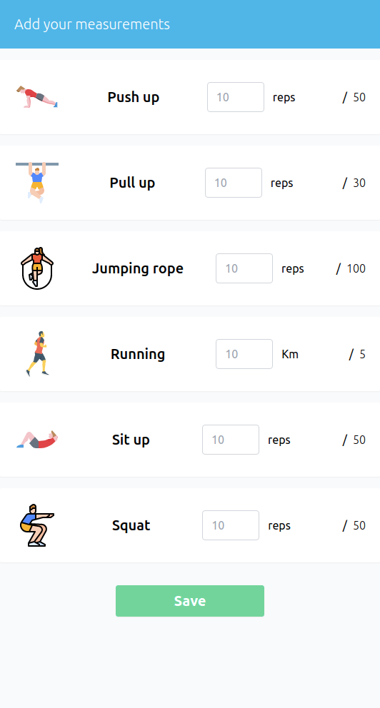

# Track my fitness Application
---
## About

A fitness tracking app to measure daily exercises performed and stay focused on achieving the target.

## Application features

User can use this application to keep the measurements of the exercise they have done. The features of the project is listed as below:

- User can login and register to the system.
- User can keep their measurements of the exercise.
- User can view all the list of measurements.
- User can go the detail of spcific measurements and find the information with progress chart.
- User can view the progress report for monthly and weekly in a bar and pie chart.

## Getting the app in the local machine.

### Installation instructions

- Clone the repo and navigate to the directory
- Install the npm package with `npm install`
- Start the server with `npm start`
- Open your browser at [localhost](http://localhost:3000/).

## Live Demo

This project is hosted on netlify.

[Live demo link](https://track-my-fitness-ui.netlify.app/)

## Built With

- node.js
- react.js
- react-redux
- redux
- prop-types
- create-react-app
- npm

## Available Scripts

In the project directory, you can run:

### `npm start`

Runs the app in the development mode.\
Open [http://localhost:3000](http://localhost:3000) to view it in the browser.

The page will reload if you make edits.\
You will also see any lint errors in the console.

### `npm test`

Launches the test runner in the interactive watch mode.\
See the section about [running tests](https://facebook.github.io/create-react-app/docs/running-tests) for more information.

### `npm run build`

Builds the app for production to the `build` folder.\
It correctly bundles React in production mode and optimizes the build for the best performance.

The build is minified and the filenames include the hashes.\
Your app is ready to be deployed!

See the section about [deployment](https://facebook.github.io/create-react-app/docs/deployment) for more information.

### `npm run eject`

**Note: this is a one-way operation. Once you `eject`, you can’t go back!**

If you aren’t satisfied with the build tool and configuration choices, you can `eject` at any time. This command will remove the single build dependency from your project.

Instead, it will copy all the configuration files and the transitive dependencies (webpack, Babel, ESLint, etc) right into your project so you have full control over them. All of the commands except `eject` will still work, but they will point to the copied scripts so you can tweak them. At this point, you’re on your own.

You don’t have to ever use `eject`. The curated feature set is suitable for small and middle deployments, and you shouldn’t feel obligated to use this feature. However, we understand that this tool wouldn’t be useful if you couldn’t customize it when you are ready for it.

## Authors

👤 **Dipesh Bajgain**

- GitHub: [@dipbazz](https://github.com/dipbazz)
- Twitter: [@dipbazz](https://twitter.com/dipbazz)
- LinkedIn: [Dipesh Bajgain](https://www.linkedin.com/in/dipbazz/)

## 🤝 Contributing

Contributions, issues, and feature requests are welcome!

## Show your support

Give a ⭐️ if you like this project!

<!-- ## Acknowledgments -->

## 📝 License

This project is [CC0](./LICENSE) licensed.
